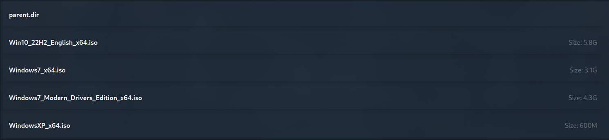

# API Implementation for cdndwnld.invra.net

## Endpoint
The file system which the website will be reading is constructed using JSON. If you have no clue how to use JSON, please refer below or find some documentation on using a constructed dataset with arrays in JSON.

### **Authentication**
At this point in time, we will not have any sort of authentication system. There is discussion to add Key authentication. Please, before this goes into effect, understand how to store API or Data keys safely.

### **Request**

```HTTP
GET /pub
```
This will be a GET request to https://corsproxy.io/?https%3A%2F%2Fservice.api.cdndwnld.invra.net.

### **Example Response**
 ```JSON
{
  "name": "root",
  "type": "directory",
  "children": [
    {
      "name": "Windows",
      "type": "directory",
      "children": [
        {
          "name": "Win10_22H2_English_x64.iso",
          "type": "file",
          "size": "5.8G",
	      "internal": true,
          "html_pathex": "Windows/Win10_22H2_English_x64.iso",
          "html_exturl": null
        },
        {
          "name": "Windows7_x64.iso",
          "type": "file",
          "size": "3.1G",
	      "internal": true,
          "html_pathex": "Windows/Windows7_x64.iso",
          "html_exturl": null
        }
      ]
    },
    {
      "name": "OSX",
      "type": "directory",
      "children": [
        {
          "name": "macOS_Catalina_Base.dmg",
          "type": "file",
          "size": "476M",
	      "internal": true,
          "html_pathex": "OSX/macOS_Catalina_Base.dmg",
          "html_exturl": null
        }
      ]
    }
  ]
}
 ```

 Below, the attributes will be broken down into what should be done with them.

- `name`: The name of the file or the directory in which the file is located on the CDN's filesystem. You will be making the calls yourself using a HREF using this.
- `type`: This is used to tell your script if it's a folder or a file.
- `size`: This is used for frontend use only. It indicates the amount of space the file takes up on the disk. For example: `4.6G (GiB)`.
- `internal`: This is to tell the website whether to check our CDN or someone else's.
- ``html_pathex``: This is what is used to construct the URL. An example of this being used is below in the next section.
- `html_exturl`: This refers to if the file is directly on the CDN or downloaded via an external URL. So, if `internal` is equal to `false`, use ``html_exturl`` for the URL. ``html_exturl`` is present on the database at all times, just when ``internal`` is equal to ``true`` it will be ``null``.

 ## Managing CDN URL
 ### Internal
Your URL will be a string composed of two variables: the path the user is in and the filename.
In JavaScript, an example of this would be:
```JS
 let fileUrl = `https://cdndwnld.invra.net/pub/${item.html_pathex}`;
```
 #### External
Yor URL here will be decided based on what present data there is for the file. Of course, you will have an exception, so in this case, if `internal === false && html_exturl`, then we will be using the data from `html_exturl`.
In JavaScript, this will look like:
```JS
    if (item.internal === false && item.html_exturl) {
        fileUrl = item.html_exturl;
    }
```
Note: `item` is how I've decided to construct the data.

## Constructing a Frontend for the User
From here on out, the example will be in JavaScript. You can figure out how to deal with JSON data after fetching the JSON with your programming language's documentation. 
What you have the ability to do with this API is make it your own. You just have to pull the data and then construct it in the way you want. 
An example of how we can do a frontend is with DIV tags and A tags.
When constructing the file and folder structure, you will want to have a "To Parent Directory" button of some sort, since this is a **Statically done system**. If you want to put in work and throw in many different HTML pages, or a script which will handle your root path + the following paths, so be it.
Below is what I use for my website and can be implemented in such a way for your website.
```JS
function displayDownloads(children, currentPath = "") {
    const fileContainer = document.getElementById('file-container');
    fileContainer.innerHTML = '';
    const fileList = document.createElement('div');
    if (currentPath && currentPath !== "/") {
        const upLevelElem = document.createElement('div');
        upLevelElem.classList.add('cursor-pointer', 'include-block', 'bg-gray-800', 'rounded-lg', 'p-4', 'shadow-lg', 'mb-3', 'hover::last:text-underline');
        upLevelElem.addEventListener("click", function() {
            const parentPath = currentPath.split('/').slice(0, -1).join('/');
            fetchFiles(parentPath);
        });
        upLevelElem.innerHTML = `
            <div class="group">
                <div class="flex justify-between items-center">
                    <p id="name" class="font-semibold text-lg text-primary-500">parent.dir</p>
                    <span class="text-gray-500"></span>
                </div>
            </div>
        `;
        fileList.appendChild(upLevelElem);
    }
    
    children.forEach(item => {
        const itemElem = document.createElement('div');
        if (item.type === 'file') {
            let fileLocation = `https://cdndwnld.invra.net/pub/${html_pathex}`;
            if (item.internal === false && item.html_exturl) {
                fileLocation = item.html_exturl;
            }
            itemElem.classList.add('cursor-pointer', 'include-block', 'bg-gray-800', 'rounded-lg', 'p-4', 'shadow-lg', 'mb-3', 'hover::last:text-underline');
            itemElem.addEventListener("click", function() {
                window.location.href = fileLocation;
            });
            itemElem.innerHTML = `
                <div class="group">
                    <div class="flex justify-between items-center">
                        <p id="name" class="font-semibold text-lg text-primary-500">${item.name}</p>
                        <span class="text-gray-500">Size: ${item.size}</span>
                    </div>
                </div>
            `;
        } else if (item.type === 'directory') {
            itemElem.classList.add('cursor-pointer', 'include-block', 'bg-gray-800', 'rounded-lg', 'p-4', 'shadow-lg', 'mb-3', 'hover::last:text-underline');
            itemElem.addEventListener("click", function() {
                displayDownloads(item.children, currentPath !== "" ? `${currentPath}/${item.name}` : item.name);
            });
            itemElem.innerHTML = `
                <div class="group">
                    <div class="flex justify-between items-center">
                        <p id="name" class="font-semibold text-lg text-primary-500">${item.name}</p>
                        <span class="text-gray-500">[Folder]</span>
                    </div>
                </div>
            `;
        }
        fileList.appendChild(itemElem);
    });
    fileContainer.appendChild(fileList);
}
```

This system above is done entirely statically, so it will always be at https://invra.net/download. This can make site-mapping way easier. 
All you need to fetch is `https://corsproxy.io/?https%3A%2F%2Fservice.api.cdndwnld.invra.net/pub`. 
This function, `displayDownloads`, is responsible for populating a file container element on a web page with a list of downloadable files and directories. Let's break down each part of the function:

### Parameters 
   - `children`: Represents an array of objects containing information about files and directories.
   - `currentPath` (optional): Represents the current path in the file system. Defaults to an empty string if not provided.

### Accessing the DOM Element
   - `fileContainer`: Retrieves the DOM element with the id 'file-container', which presumably serves as the container for the list of files and directories.
   - `fileContainer.innerHTML = ''`: Clears the contents of the file container to prepare for updating it with new files and directories.

### Creating a File List Container
   - `fileList`: Creates a new `<div>` element to serve as a container for the list of files and directories.

### Adding a "Go Up" Option
   - Checks if there is a `currentPath` and it's not the root directory ("/").
   - If true, creates a clickable element (`upLevelElem`) that, when clicked, navigates to the parent directory.
   - Appends this element to the `fileList`.

### Iterating Through Children
   - Loops through each item in the `children` array.
   - Creates a new `<div>` element (`itemElem`) for each item.

### Handling Files
   - If the item is a file:
     - Constructs the file's location based on the `currentPath` and the file's name.
     - If the file is an external link, it overrides the location with the provided external URL.
     - Adds an event listener to the `itemElem` so that when clicked, it redirects the user to the file location.
     - Appends information about the file (name and size) to the `itemElem`.

### Handling Directories
   - If the item is a directory:
     - Adds an event listener to the `itemElem` so that when clicked, it recursively calls `displayDownloads` with the children of the directory and updates the `currentPath`.
     - Appends information about the directory (name and a marker indicating it's a folder) to the `itemElem`.

### Appending Elements
   - Appends each `itemElem` (file or directory) to the `fileList`.

### Updating the DOM
   - Appends the `fileList` containing all the files and directories to the `fileContainer`, updating the DOM with the new content.

## Example on what this will look like.
